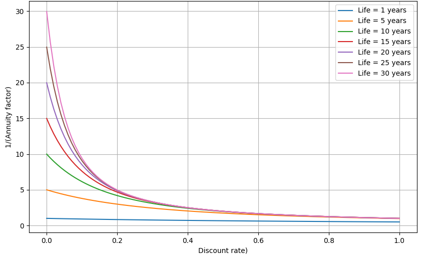

.. _chp_financial:

Financial
=========

MESIDO offers the posibility to model the cost and revenues based on the design and operation of the energy system.
The asset cost modelling includes both the CAPEX and OPEX over the time-horizon of the optimization.

Asset Cost Components
---------------------

The asset cost modelling breaks down in four categories in which both the CAPEX and OPEX aspects are captured: 

- installation cost
- investment cost
- variable operational costs
- fixed operational cost

These four categories help the optimizer in making both continuous and integer sizing decisions.

Installation Cost
~~~~~~~~~~~~~~~~~

Installation cost is part of the CAPEX and is the fixed amount of cost required to place :math:`\delta^{a}_{aggr\_count}` units (aggregation count) of the asset :math:`a`.
This cost component helps the optimizer make asset placement decisions when several equivalent asset options are available.

.. math::
    :label: eq:installation

    Cost^{a}_{installation} = C^{a}_{install} \delta^{a}_{aggr\_count}

Investment Cost
~~~~~~~~~~~~~~~

The investment cost is the CAPEX required that scales with the asset size.
The investment cost is the cost component that helps to find the minimum asset sizes.

.. math::
    :label: eq:invest

    Cost^{a}_{investment} = C^{a}_{invest} x^{a}_{max}

Variable Operational Cost
~~~~~~~~~~~~~~~~~~~~~~~~~

The variable operational cost is the cost component that depends on the usage of the asset over the time horizon.
Typically this is a power consumption or production, which is represented by :math:`x^{a}_{use}`.

.. math::
    :label: eq:varopex

    Cost^{a}_{variable} = \sum_{K} C^{a}_{variable} x^{a}_{use} \Delta T_K

Fixed Operational Cost
~~~~~~~~~~~~~~~~~~~~~~

The fixed operational cost is the cost component that returns every X time (typically every calendar year) based on the size of the asset.

.. math::
    :label: eq:fixedopex

    Cost^{a}_{fixed} = C^{a}_{fixed} x^{a}_{max}

Total Cost Calculation
----------------------

The total cost is defined as the sum of CAPEX and OPEX over the set of assets in the optimization problem, as follows:

.. math::
    :label: eq:totalcost

    Cost_{total} = \sum_{a} (Cost^{a}_{CAPEX} + Cost^{a}_{OPEX})

where the CAPEX is the sum of the installation and investment costs, i.e.,

.. math::
    :label: eq:capex_no_discount

    Cost^{a}_{CAPEX} = \sum_{a} (Cost^{a}_{investment} + Cost^{a}_{installation}),

and the OPEX is the sum of the variable and fixed operational costs, i.e.,

.. math::
    :label: eq:opex

    Cost^{a}_{OPEX} = \sum_{a} (Cost^{a}_{fixed} + Cost^{a}_{variable})

.. _discounted-cost-section:

Annualized Discounted Costs Calculation
---------------------------------------

Discounted cost calculations account for the time value of money, which reflects the principle that money available today is worth more than the same amount in the future due to its potential earning capacity. Discounted costs are commonly used for evaluating investment decisions.

Since assets may have different depreciation periods, an Equivalent Annual Cost (EAC) provides a standardized comparison by converting the total cost of ownership to an annualized figure that accounts for both the time value of money and the different lifetimes of assets.

Given that the OPEX :math:numref:`eq:opex` is already calculated on an annual basis, only the CAPEX needs to be converted to an annualized equivalent value using an EAC factor :math:`F_{a}`. This factor is computed as based on a discount rate (as an annual percentage) and the technical life (in years) of the asset, as follows:

.. math::    
    F_{a} = 
    \begin{cases} 
    \frac{1}{n} & \text{if } r = 0 \\ 
    \frac{r}{1 - (1 + r)^{-n}} & \text{if } r > 0 
    \end{cases}

See this `link <https://www.investopedia.com/terms/e/eac.asp>`_ for more details.

This EAC factor, :math:`F_{a}`, is then applied to the asset's CAPEX to calculate the EAC of the initial investment or installation cost, as follows:

.. math::
    :label: eq:capex_eac

    Cost^{a}_{CAPEX_{EAC}} = (Cost^{a}_{investment} + Cost^{a}_{installation}) * F_{a}

Therefore, the discounted total cost becomes:

.. math::
    :label: eq:total_eac

    Cost_{total_{EAC}} = \sum_{a} (Cost^{a}_{CAPEX_{EAC}} + Cost^{a}_{OPEX})

Note that the annual discount rate is a real number between 0 and 1. For instance, a discount rate of 5% should be specified as 0.05. 
The technical life is a real number greater than 0. Both the discount rate and the technical life of assets can significantly affect the EAC of an asset, as shown below, where the inverse :math:`F_{a}` factor is plotted.

    Inverse Equivalent Annual Cost factor ( :math:`F_a^{-1}` ) versus discount rate ( `r` ) for different technical life values.
