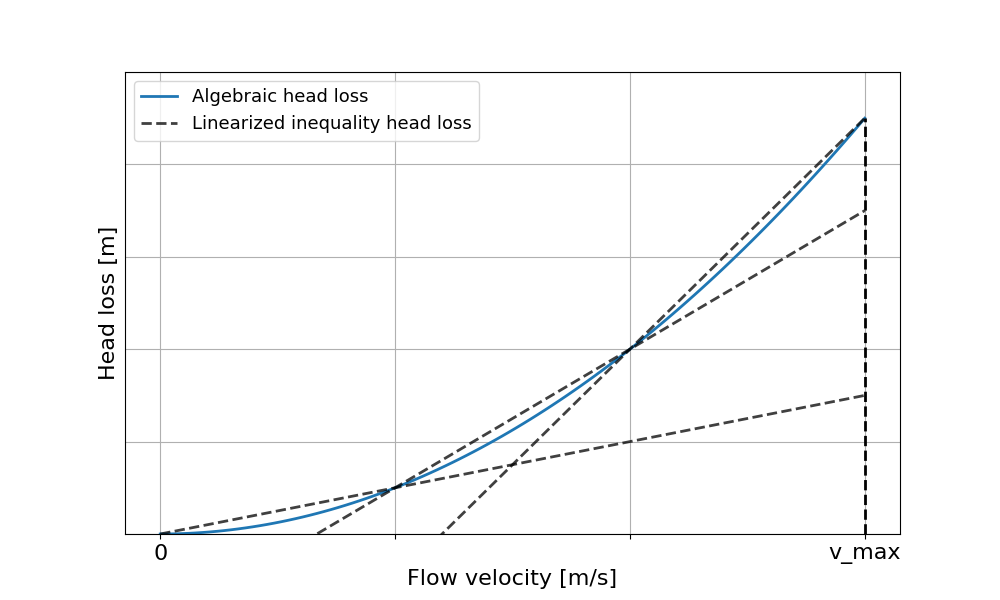

.. _chp_gas_physics:

Gas Physics
===========

MESIDO models the volumetric flow (:math:`\dot{V}`), the mass flow (:math:`\dot{m}`), the head
(:math:`H`) and the hydraulic power (:math:`HP`).
These variables are modelled over all timesteps :math:`K` and for each asset in the system
:math:`A`.
An asset :math:`a \in A` in the system is modelled using a set of in-ports, denoted by
:math:`I^a_{in} \neq \emptyset`, and a set of out-ports, denoted by
:math:`I^a_{out} \neq \emptyset`, with :math:`I^a` denoting the union of these two sets.
For an asset :math:`a` the variables :math:`\dot{V}_i, \dot{m}_i`,
:math:`H_i` and :math:`HP_i` denote the volumetric flow, mass flow, head and hydraulic power for port :math:`i \in I^a`.
For readability, the variables and equations of the model, given below, are defined without
indexing the variables and sets for each timestep.
The equations below are assumed to hold for every timestep, unless otherwise specified.

By modelling these variables the gaseous system can be closely approximated. The method will show that for the modelling assumptions a feasible conservative solution will be guaranteed.

Incompressible Flow
-------------------

Under incompressible flow assumption the volumetric- and mass flow for every asset should equate to zero.

.. math::
    :label: eq:Q_balance

    \sum_{i \in I} \dot{V}_i + \dot{V}^a_{consumed} = 0 \;\; \forall a \in A.

.. math::
    :label: eq:m_balance

    \sum_{i \in I} \dot{m}_i + \dot{m}^a_{consumed} = 0 \;\; \forall a \in A.

:math:`\dot{V}^a_{consumed}` and :math:`\dot{m}^a_{consumed}` are the volumetric- and mass flow consumed by asset :math:`a`.

Network Physics
---------------

Pipe
~~~~
The main function of a pipe is to transport gas mass.
In reality it loses part of this mass as the pipe is pressurized and has small leaks.
Within MESIDO it is assumed that these leaks are small and are neglected in the optimization.

Equality constraints are used to relate the volumetric flow to the mass flow.

.. math::
    :label: eq:vol_to_mass

    \dot{m}^a = \rho \dot{V}^a \;\; \forall a \in A_{pipes}.

Where :math:`\rho` is the density of the medium which is assumed constant in one hydrualic
coupled system and is set based on the design nominal pressure in the system.

The head loss, :math:`dH` must be compensated by pumps which are assumed to be located at sources
and storage assets.

.. math::
    :label: eq:gas_pipe_head

    H^a_{in} - dH = H^a_{out} \;\; \forall a \in A_{pipes}.

Steady-state head losses can be closely modelled with a quadratic relation w.r.t. :math:`\dot{V}`.
A set of linear inequalities is used, see :numref:`inequalitydH`, to approximate the quadratic curve.
The general form of the inequalities is given below in :eq:`eq:pipe_head_loss1`-:eq:`eq:pipe_head_loss2`.
Note that the big M method is used with the flow direction and disconnected integers to allow for
modelling of bi-directional flow and the ability to disconnect pipes.

.. math::
    :label: eq:gas_pipe_head_loss1

    dH - (\alpha_j \dot{V} + \beta_j) + (\delta^a_{discon} + \delta^a_{dir})M\geq 0 \\ \forall (\alpha_j, \beta_j) \;\; \forall a \in A_{pipes},

.. math::
    :label: eq:gas_pipe_head_loss2

    dH + (\alpha_j\dot{V} + \beta_j) - (\delta^a_{discon} + (1-\delta^a_{dir}))M\leq 0 \\  \forall (\alpha_j, \beta_j) \;\; \forall a \in A_{pipes}.

Where :math:`(\alpha_j, \beta_j)` are the coefficients and constants of the linear equations used to approximate the quadratic equation.

These inequalities force the head loss to be greater or equal to the approximated quadratic curve.
Although the constraints by themselves will not guarantee a physically feasible answer, the optimization will in drag the solution to an equality constraint as the objective function will minimize cost which reduces with lower pressure drop.

.. _inequalitydH:

    Schematic visualization of how the linear constraints are fitted to the gas pipe head loss curve.

Similar as with head loss the hydraulic power, :math:`HP^a`, required to overcome the head losses is modelled with a set of linear inequalities:

.. math::
    :label: eq:gas_pipe_hp1

    HP^a - (c_j\dot{V} + d_j)  + (\delta^a_{discon} + 1-\delta^a_{dir})M \geq 0 \\
    \forall (c_j, d_j) \;\; \forall a \in A_{pipes},

.. math::
    :label: eq:gas_pipe_hp2

    HP^a - (c_j\dot{V} + d_j)  - (\delta_{discon}(k) - 1-\delta_{dir})M\geq 0 \\
    \forall (c_j, d_j) \;\; \forall a \in A_{pipes}.

Here :math:`(c_j, d_j)` are the coefficients and constants of the linear equations used to approximate the quadratic equation.

The method with linear inequalities, as represented above, is only valid when each possible unique flow path route in the network has a control valve to compensate non-physical head loss induced by the optimizer. Alternatively a (piece-wise) linear equality constraint between min and max flow rate can be configured for cases where this assumption is invalid, with the general form represented by :eq:`eq:pipe_head_loss3`-:eq:`eq:pipe_head_loss6`.

.. math::
    :label: eq:gas_pipe_head_loss3

    dH - (\alpha_j \dot{V} + \beta_j) + (\delta^a_{discon} + \delta^a_{dir} + (1 - \delta^a_{line\_seg_{k}}))M\geq 0 \\ \delta^a_{line\_seg_{k}} \in \{ 0, 1 \}, (\alpha_j, \beta_j) \;\; \forall a \in A_{pipes},

.. math::
    :label: eq:gas_pipe_head_loss4

    dH - (\alpha_j\dot{V} + \beta_j) - (\delta^a_{discon} + \delta^a_{dir} + (1 - \delta^a_{line\_seg_{k}}))M\leq 0 \\  \delta^a_{line\_seg_{k}} \in \{ 0, 1 \}, (\alpha_j, \beta_j) \;\; \forall a \in A_{pipes},

.. math::
    :label: eq:gas_pipe_head_loss5

    dH + (\alpha_j \dot{V} + \beta_j) - (\delta^a_{discon} + (1 - \delta^a_{dir}) + (1 - \delta^a_{line\_seg_{k}}))M\leq 0 \\ \delta^a_{line\_seg_{k}} \in \{ 0, 1 \}, (\alpha_j, \beta_j) \;\; \forall a \in A_{pipes},

.. math::
    :label: eq:gas_pipe_head_loss6

    dH + (\alpha_j\dot{V} + \beta_j) + (\delta^a_{discon} + (1-\delta^a_{dir}) + (1 - \delta^a_{line\_seg_{k}}))M\geq 0 \\  \delta^a_{line\_seg_{k}} \in \{ 0, 1 \}, (\alpha_j, \beta_j) \;\; \forall a \in A_{pipes}.

Where :math:`(\alpha_j, \beta_j)` are the coefficients and constants of the linear equations used to approximate the quadratic equation. Variable :math:`\delta^a_{line\_seg_{k}}` reperesents an integer, for pipe :math:`a`, value indicating if a linear line segment :math:`k` is active (value = 1) or not (value = 0). This would imply that if a quadratic curve is represented by 3 linear lines for instance, then only 1 of the linear lines are appplicable at a specific timestep.

Node
~~~~

The node conserves the flow with :eq:`eq:Q_balance` and the energy with :eq:`eq:m_balance`.

The head of all pipes connected to the node must be equal to ensure a hydraulically feasible solution:

.. math::
    :label: eq:gas_node_head

    H_i = H^a \;\; \forall i \in I^a \;\; a \in A_{nodes},

where :math:`A_{nodes}` is the set of all nodes and :math:`H^a` is the headloss for node :math:`a`.

Asset Physics
-------------

Source
~~~~~~

The source adds gas mass to the network.
The volumetric- and mass flow balance is given by :eq:`eq:Q_balance` and :eq:`eq:m_balance` where
:math:`\dot{V}^a_{consumed}` and :math:`\dot{m}^a_{consumed}` is equal to the (negative) value of the supplied gas to the network.

A source is modelled with a pump to reach its desired flow rate and head:

.. math::
    :label: eq:gas_source_pump_dh

    H^a_{pump} = H^a_{out} \;\; \forall a \in A_{prod}.

Demand
~~~~~~

A demand extracts gas from the network, defined by :eq:`eq:Q_balance` and :eq:`eq:m_balance` where
:math:`\dot{V}^a_{consumed}` and :math:`\dot{m}^a_{consumed}` are the consumed gas from the network.

Every demand is modelled with a control valve to regulate its flow. In reality a minimum head loss is often maintained:

.. math::
    :label: eq:gas_demand_head

    H_{connected} - dH_{valve} = H^a_{out} \;\; \forall a \in A_{demand}.

Where :math:`H_{connected}` is the head at the port of the connected asset (normally a pipe).

Storage
~~~~~~~

Storage assets add time flexibility with the production and consumption of gas. For shorter
intra-day periods this capability is provided by tanks, alternatively storage over seasons is done
with underground storage like salt caverns.

:math:`\dot{m}^{a}_{consumed}` can be defined by the gas mass substracted from or added to the
network, where the internal losses of the storage are subtracted:

.. math::
    :label: eq:change_stored_gas

    \dot{m}^{a}_{consumed} =  \sum_{i \in I^a_{in}} \dot{m}^{a}_{i} -  \sum_{i \in I^a_{out}} \dot{m}^{a}_{i} - \dot{m}^{a}_{loss} \;\; \forall a \in A_{storage}.

The consumed mass of the storage assets is equated to the change in stored gas mass, :math:`\dot{m}^{a}_{stored}`:

.. math::
    :label: eq:stored_gas

    \dot{m}^{a}_{consumed} = \dot{m}^{a}_{stored} \;\; \forall a \in A_{storage}

Compressor and Sub-station/control-valve
~~~~~~~~~~~~~~~~~~~~~~~~~~~~~~~~~~~~~~~~
The compressor and sub-station are used to change the nominal pressure level in the system.
This means that these assets will have a different pressure level and thus density on their in port
w.r.t. their out port.
It is assumed that mass is maintained over the pressure step.

.. math::
    :label: eq:mass_balance_pressure_level

    \sum_{i \in I^a_{in}} \dot{m}^{a} = \sum_{i \in I^a_{in}} \dot{m}^{a}\;\; \forall a \in A_{Compressor, sub-station}

